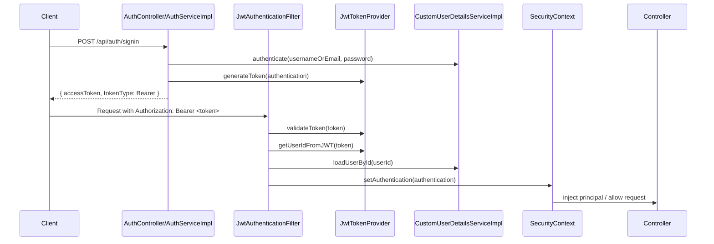

# Booking API

REST API quản lý đặt phòng khách sạn, xây dựng theo **feature-based layered architecture**: mỗi business feature tự chứa controller, DTO, model, repository, service; phần dùng chung nằm trong `common`.

Tham khảo cấu trúc: [osopromadze/Spring-Boot-Blog-REST-API](https://github.com/osopromadze/Spring-Boot-Blog-REST-API)

## Tech Stack

| | |
|---|---|
| Java | 21 |
| Spring Boot | 4.0.5 |
| Spring Security | 7.x (stateless JWT) |
| Spring Data JPA | Hibernate 7 |
| Flyway | quản lý schema migration |
| PostgreSQL | database chính |
| H2 | in-memory database cho test |
| JJWT | 0.12.3 |
| Lombok | giảm boilerplate |

## JWT / Security

BookingAPI dùng **stateless JWT** cho phần xác thực:

- `POST /api/auth/signup` và `POST /api/auth/signin` là public
- `GET /api/hotels/**` được phép truy cập không cần đăng nhập
- các endpoint còn lại cần JWT hợp lệ
- các thao tác admin dùng `@PreAuthorize("hasRole('ADMIN')")`
- các thao tác lễ tân như check-in, check-out, no-show dùng `@PreAuthorize("hasAnyRole('ADMIN', 'RECEPTIONIST')")`
- controller có thể nhận user hiện tại qua `@CurrentUser`

Tài liệu lý thuyết + ví dụ chi tiết: [`docs/jwt-security-guide.md`](docs/jwt-security-guide.md)

Tài liệu walkthrough REST API: [`docs/rest-api-walkthrough.md`](docs/rest-api-walkthrough.md)

### JWT Flow



#### Luồng xử lý ngắn gọn

1. `AuthController` nhận request login qua `/api/auth/signin`.
2. `AuthServiceImpl` dùng `AuthenticationManager` để xác thực username/password.
3. Nếu đúng, `JwtTokenProvider.generateToken()` tạo access token với `subject = userId`.
4. Client gửi token ở header `Authorization: Bearer <token>`.
5. `JwtAuthenticationFilter` lấy token, kiểm tra chữ ký và hạn dùng.
6. Nếu hợp lệ, filter load user từ DB bằng `loadUserById()` và set vào `SecurityContextHolder`.
7. Controller có thể lấy user hiện tại bằng `@CurrentUser UserPrincipal currentUser`.
8. Các route ghi dữ liệu admin được chặn bởi `@PreAuthorize("hasRole('ADMIN')")`.

#### Mapping theo class

| Class | Vai trò |
|---|---|
| `SecurityConfig` | bật stateless JWT, gắn filter, khai báo public/private endpoints |
| `JwtTokenProvider` | tạo token, giải mã `userId`, validate token |
| `JwtAuthenticationFilter` | đọc header `Authorization` và set authentication |
| `CustomUserDetailsServiceImpl` | load user theo username/email hoặc id |
| `UserPrincipal` | đại diện user trong Spring Security |
| `CurrentUser` | inject user hiện tại vào controller |
| `JwtAuthenticationEntryPoint` | trả `401 Unauthorized` khi chưa/không thể xác thực |

## Package Structure

```text
com.example.bookingapi
├── BookingApiApplication.java
├── common/
│   ├── audit/                    # DateAudit, UserDateAudit base entity classes
│   ├── config/                   # AuditingConfig, SecurityConfig, WebMvcConfig, OpenApiConfig
│   ├── exception/                # AppException, ResourceNotFoundException, GlobalExceptionHandler...
│   ├── openapi/                  # common Swagger/OpenAPI annotations
│   ├── response/                 # ApiErrorResponse, ApiMessageResponse, PagedResponse
│   ├── security/                 # JWT filter/provider, CurrentUser, UserPrincipal
│   ├── storage/                  # MinIO/ObjectStorage abstraction
│   ├── upload/                   # upload endpoint + upload DTO/enums
│   └── util/                     # AppConstants
└── features/
    ├── auth/                      # auth controller, auth DTO, Role/Manager/OTP, auth services
    ├── user/                      # user profile/read models
    ├── hotel/                     # hotel, location, hotel images
    ├── room/                      # room type, room, amenity
    └── booking/                   # booking, booked room, guest, discount, cancellation policy
```

Trong mỗi feature, layout mặc định là:

```text
controller/
dto/request/
dto/response/
model/
model/enums/
repository/
service/
service/impl/
```

Rule hiện tại: nếu logic chỉ phục vụ một feature thì để trong feature đó; nếu dùng chéo nhiều feature hoặc là cross-cutting concern như security, exception, audit, upload, response wrapper thì để trong `common`.

## Database

Schema được quản lý bằng **Flyway**. JPA chỉ `validate` — không tự tạo/sửa bảng.

### Migrations

| File | Nội dung |
|---|---|
| `V1__create_core_tables.sql` | `app_users`, `auth_refresh_tokens`, `info_messages` (legacy) |
| `V2__seed_demo_data.sql` | seed demo user và messages |
| `V3__add_core_tables.sql` | `roles`, `users`, `user_roles`, `hotels`, `rooms`, `bookings` + seed 2 roles |

### Tạo database local

```bash
createdb booking_api
```

### Schema chính (V3)

```
users       — id, name, username, email, password, created_at, updated_at
roles       — id, name (ROLE_USER / ROLE_ADMIN / ROLE_RECEPTIONIST)
user_roles  — user_id, role_id
hotels      — id, name, description, address, city, country, ...audit
rooms       — id, hotel_id, room_number, room_type, capacity, price_per_night, ...audit
bookings    — id, user_id, room_id, check_in_date, check_out_date, total_price, status, ...audit
```

Tài liệu JPA & Database integration: [`docs/jpa-database-guide.md`](docs/jpa-database-guide.md)

## Biến Môi Trường

App dùng Spring Boot native config import để đọc file `.env` tự động — không cần `export` mỗi lần.

**Setup:**

```bash
cp .env.sample .env
# chỉnh giá trị trong .env nếu cần
```

Spring sẽ load `.env` thông qua:

```properties
spring.config.import=optional:file:.env[.properties]
```

| Biến | Mặc định trong `.env.sample` |
|---|---|
| `DB_URL` | `jdbc:postgresql://localhost:5432/booking_api` |
| `DB_USERNAME` | `postgres` |
| `DB_PASSWORD` | `postgres` |
| `JWT_SECRET` | _(cần thay bằng secret thật)_ |
| `REDIS_HOST` | `localhost` |
| `REDIS_PORT` | `6379` |

> `.env` đã được gitignore — không commit credentials. Chỉ commit `.env.sample`.

## Local Dev Services

### Redis

Redis chạy bằng container riêng, dùng cho idempotency/cache local dev.

Tài liệu chi tiết: [`docs/redis-local-dev.md`](docs/redis-local-dev.md)

Start lần đầu:

```bash
docker compose -f docker-compose.redis.yml up -d
```

Kiểm tra:

```bash
docker exec booking-redis redis-cli ping
```

Kết quả mong đợi:

```text
PONG
```

Stop nhưng giữ data volume:

```bash
docker compose -f docker-compose.redis.yml down
```

Xoá luôn data volume local:

```bash
docker compose -f docker-compose.redis.yml down -v
```

## Chạy Ứng Dụng

**Yêu cầu:** Java 21, PostgreSQL đang chạy, database `booking_api` đã tạo.

```bash
./mvnw spring-boot:run
```

App chạy trên `http://localhost:8080`.

## API Reference

### Authentication

#### `POST /api/auth/signup` — Đăng ký

```bash
curl -X POST http://localhost:8080/api/auth/signup \
  -H "Content-Type: application/json" \
  -d '{
    "name": "Alice Nguyen",
    "username": "alice",
    "email": "alice@example.com",
    "password": "secret123"
  }'
```

Response:
```json
{ "success": true, "message": "User registered successfully" }
```

#### `POST /api/auth/signin` — Đăng nhập

```bash
curl -X POST http://localhost:8080/api/auth/signin \
  -H "Content-Type: application/json" \
  -d '{ "usernameOrEmail": "alice", "password": "secret123" }'
```

Response:
```json
{ "accessToken": "<jwt>", "tokenType": "Bearer" }
```

Dùng token này ở các endpoint cần xác thực:
```
Authorization: Bearer <accessToken>
```

### Hotels

| Method | Endpoint | Auth | Mô tả |
|---|---|---|---|
| GET | `/api/hotels` | không cần | Lấy danh sách (phân trang) |
| GET | `/api/hotels/{id}` | không cần | Chi tiết khách sạn |
| POST | `/api/hotels` | ADMIN | Thêm khách sạn |
| PUT | `/api/hotels/{id}` | ADMIN | Cập nhật |
| DELETE | `/api/hotels/{id}` | ADMIN | Xoá |

```bash
# Lấy danh sách
curl http://localhost:8080/api/hotels?page=0&size=10

# Thêm (cần ADMIN token)
curl -X POST http://localhost:8080/api/hotels \
  -H "Authorization: Bearer <token>" \
  -H "Content-Type: application/json" \
  -d '{
    "name": "Grand Palace Hotel",
    "description": "5-star hotel in city center",
    "address": "123 Main St",
    "city": "Ho Chi Minh City",
    "country": "Vietnam"
  }'
```

### Rooms

| Method | Endpoint | Auth | Mô tả |
|---|---|---|---|
| GET | `/api/hotels/{hotelId}/rooms` | không cần | Danh sách phòng |
| GET | `/api/hotels/{hotelId}/rooms/{id}` | không cần | Chi tiết phòng |
| POST | `/api/hotels/{hotelId}/rooms` | ADMIN | Thêm phòng |
| PUT | `/api/hotels/{hotelId}/rooms/{id}` | ADMIN | Cập nhật |
| DELETE | `/api/hotels/{hotelId}/rooms/{id}` | ADMIN | Xoá |

```bash
curl -X POST http://localhost:8080/api/hotels/1/rooms \
  -H "Authorization: Bearer <token>" \
  -H "Content-Type: application/json" \
  -d '{
    "roomNumber": "101",
    "roomType": "Deluxe",
    "capacity": 2,
    "pricePerNight": 150.00
  }'
```

### Bookings

| Method | Endpoint | Auth | Mô tả |
|---|---|---|---|
| POST | `/api/bookings` | đăng nhập | Tạo booking |
| GET | `/api/bookings/me` | đăng nhập | Booking của tôi |
| GET | `/api/bookings/{id}` | đăng nhập | Chi tiết booking |
| DELETE | `/api/bookings/{id}` | đăng nhập | Huỷ booking |
| PATCH | `/api/bookings/{id}/status` | ADMIN | Chuyển trạng thái booking theo state machine |

```bash
curl -X POST http://localhost:8080/api/bookings \
  -H "Authorization: Bearer <token>" \
  -H "Content-Type: application/json" \
  -d '{
    "rooms": [
      {
        "roomTypeId": "41000000-0000-0000-0000-000000000001",
        "quantity": 1
      }
    ],
    "checkInDate": "2026-05-10",
    "checkOutDate": "2026-05-13"
  }'
```

#### Booking State Machine

Booking mới được tạo ở trạng thái `PENDING`. Mọi thay đổi trạng thái phải đi qua `BookingStateMachine`; nếu transition không hợp lệ, API trả `400 Bad Request`.

Transition hiện tại:

```text
PENDING     -> CONFIRMED, CANCELLED
CONFIRMED   -> CHECKED_IN, CANCELLED, NO_SHOW
CHECKED_IN  -> CHECKED_OUT
CHECKED_OUT -> REFUNDED
CANCELLED   -> REFUNDED
REFUNDED    -> terminal
NO_SHOW     -> terminal
```

User có thể huỷ booking của chính mình qua `DELETE /api/bookings/{id}` nếu booking đang ở trạng thái cho phép huỷ. Admin có thể chuyển trạng thái bằng:

```bash
curl -X PATCH http://localhost:8080/api/bookings/<booking-id>/status \
  -H "Authorization: Bearer <admin-token>" \
  -H "Content-Type: application/json" \
  -d '{ "status": "CONFIRMED" }'
```

### Users

| Method | Endpoint | Auth | Mô tả |
|---|---|---|---|
| GET | `/api/users/me` | đăng nhập | Thông tin người dùng hiện tại |
| GET | `/api/users/{username}` | không cần | Xem profile theo username |
| GET | `/api/users/checkUsernameAvailability?username=alice` | không cần | Kiểm tra username |
| GET | `/api/users/checkEmailAvailability?email=alice@example.com` | không cần | Kiểm tra email |

## Error Response

Lỗi được chuẩn hóa bởi `GlobalExceptionHandler`:

```json
{ "success": false, "message": "Hotel not found with id : '99'" }
```

Validation lỗi trả về field-level:

```json
{
  "name": "must not be blank",
  "pricePerNight": "must not be null"
}
```

| HTTP Status | Trường hợp |
|---|---|
| 400 | Validation lỗi, dữ liệu không hợp lệ |
| 401 | Chưa đăng nhập hoặc token không hợp lệ |
| 403 | Không có quyền (ví dụ: cần ADMIN) |
| 404 | Không tìm thấy resource |
| 500 | Lỗi server |

## Test

```bash
./mvnw test
```

Test dùng H2 in-memory với profile `test`. Flyway chạy đầy đủ V1→V2→V3 trên H2 trước khi Hibernate validate.
