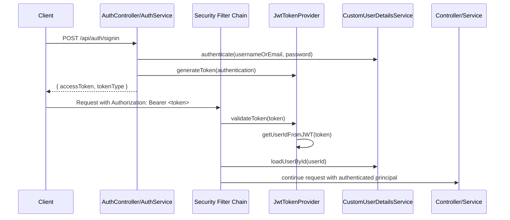

# JWT Security Guide cho BookingAPI

Tài liệu này giải thích phần **JWT stateless authentication** trong BookingAPI theo đúng codebase hiện tại, kèm ví dụ request/response và mapping sang từng class trong source code.

---

## 1. JWT là gì?

**JWT (JSON Web Token)** là một chuỗi token được ký số, thường dùng để xác thực người dùng trong API.

Một JWT gồm 3 phần:

```text
header.payload.signature
```

- **Header**: thuật toán ký, ví dụ HS256
- **Payload**: dữ liệu claims, ví dụ `sub` (subject/user id), `iat`, `exp`
- **Signature**: chữ ký bảo vệ token khỏi bị sửa đổi

### Vì sao hợp với REST API?

JWT phù hợp với REST API vì:

- **Stateless**: server không cần lưu session
- **Dễ scale**: nhiều instance vẫn xác thực được bằng secret chung
- **Tách biệt frontend/backend**: client chỉ cần giữ token và gửi qua header `Authorization`

---

## 2. JWT flow trong BookingAPI

BookingAPI đang dùng mô hình:

1. **Đăng ký** user bằng `POST /api/auth/signup`
2. **Đăng nhập** bằng `POST /api/auth/signin`
3. Server tạo JWT và trả về cho client
4. Client gửi JWT trong header:
   ```http
   Authorization: Bearer <accessToken>
   ```
5. `JwtAuthenticationFilter` đọc token ở mỗi request
6. Nếu token hợp lệ, server set `SecurityContext`
7. Controller có thể dùng:
   - `@CurrentUser` để lấy user hiện tại
   - `@PreAuthorize("hasRole('ADMIN')")` để chặn quyền admin

### Sơ đồ luồng



---

## 3. Các class JWT trong codebase

### 3.1 `SecurityConfig`

File: `src/main/java/com/example/bookingapi/config/SecurityConfig.java`

Vai trò:

- Tắt CSRF vì API dùng stateless token
- Cấu hình session `STATELESS`
- Cho phép public các endpoint:
  - `/api/auth/**`
  - `GET /api/hotels/**`
- Mọi request khác phải xác thực
- Gắn `JwtAuthenticationFilter` trước `UsernamePasswordAuthenticationFilter`

### 3.2 `JwtTokenProvider`

File: `src/main/java/com/example/bookingapi/security/JwtTokenProvider.java`

Vai trò:

- Tạo token khi login thành công
- Giải mã `sub` để lấy user id
- Kiểm tra chữ ký và thời hạn token

#### Dữ liệu JWT hiện tại

Trong code hiện tại, token được tạo với:

- `subject` = `userId`
- `issuedAt` = thời điểm tạo token
- `expiration` = `now + app.jwtExpirationInMs`

Cấu hình trong `application.properties`:

```properties
app.jwtSecret=${JWT_SECRET:booking-api-jwt-secret-key-must-be-at-least-256-bits-long}
app.jwtExpirationInMs=3600000
```

Nghĩa là:

- secret lấy từ biến môi trường `JWT_SECRET` nếu có
- mặc định token sống **1 giờ**

### 3.3 `JwtAuthenticationFilter`

File: `src/main/java/com/example/bookingapi/security/JwtAuthenticationFilter.java`

Vai trò:

- Lấy token từ header `Authorization`
- Kiểm tra format `Bearer <token>`
- Validate token qua `JwtTokenProvider`
- Load user từ DB bằng `loadUserById(userId)`
- Set `Authentication` vào `SecurityContextHolder`

### 3.4 `JwtAuthenticationEntryPoint`

File: `src/main/java/com/example/bookingapi/security/JwtAuthenticationEntryPoint.java`

Vai trò:

- Trả về HTTP `401 Unauthorized` khi request không có token hợp lệ hoặc không đăng nhập

### 3.5 `CustomUserDetailsServiceImpl`

File: `src/main/java/com/example/bookingapi/service/impl/CustomUserDetailsServiceImpl.java`

Vai trò:

- `loadUserByUsername(usernameOrEmail)` dùng cho login
- `loadUserById(id)` dùng khi filter đọc JWT xong
- Chuyển `User` sang `UserPrincipal`

### 3.6 `UserPrincipal` và `@CurrentUser`

- `UserPrincipal` implement `UserDetails`
- `@CurrentUser` là annotation custom bọc trên `@AuthenticationPrincipal`

Ví dụ:

```java
@GetMapping("/me")
public ResponseEntity<UserSummary> getCurrentUser(@CurrentUser UserPrincipal currentUser) {
    return ResponseEntity.ok(userService.getCurrentUser(currentUser));
}
```

Ý nghĩa: controller không cần tự parse token, chỉ nhận `currentUser` đã được Spring Security inject.

---

## 4. Đăng ký và đăng nhập

### 4.1 Đăng ký: `POST /api/auth/signup`

Request:

```bash
curl -X POST http://localhost:8080/api/auth/signup \
  -H "Content-Type: application/json" \
  -d '{
    "name": "Alice Nguyen",
    "username": "alice",
    "email": "alice@example.com",
    "password": "secret123"
  }'
```

Response thành công:

```json
{
  "success": true,
  "message": "User registered successfully"
}
```

#### Luồng xử lý trong `AuthServiceImpl`

- Kiểm tra username/email đã tồn tại chưa
- Mã hoá password bằng `BCryptPasswordEncoder`
- Gán role mặc định `ROLE_USER`
- Lưu user vào DB

### 4.2 Đăng nhập: `POST /api/auth/signin`

Request:

```bash
curl -X POST http://localhost:8080/api/auth/signin \
  -H "Content-Type: application/json" \
  -d '{
    "usernameOrEmail": "alice",
    "password": "secret123"
  }'
```

Response thành công:

```json
{
  "accessToken": "<jwt>",
  "tokenType": "Bearer"
}
```

#### Luồng xử lý

1. `AuthenticationManager` xác thực username/password
2. `CustomUserDetailsServiceImpl` load user
3. Spring Security so khớp password bằng BCrypt
4. `JwtTokenProvider.generateToken(authentication)` tạo access token

---

## 5. Cách dùng token ở request sau

Sau khi nhận token, client gửi kèm mọi request cần xác thực:

```http
Authorization: Bearer <accessToken>
```

Ví dụ:

```bash
curl http://localhost:8080/api/users/me \
  -H "Authorization: Bearer <accessToken>"
```

---

## 6. Ví dụ endpoint theo quyền

### 6.1 Public endpoint

Theo `SecurityConfig`, các route sau mở cho mọi người:

- `POST /api/auth/signup`
- `POST /api/auth/signin`
- `GET /api/hotels/**`

Ví dụ:

```bash
curl http://localhost:8080/api/hotels?page=0&size=10
```

### 6.2 Endpoint cần đăng nhập

Ví dụ trong `BookingController` và `UserController`:

- `POST /api/bookings`
- `GET /api/bookings/me`
- `GET /api/bookings/{id}`
- `DELETE /api/bookings/{id}`
- `GET /api/users/me`

Ví dụ tạo booking:

```bash
curl -X POST http://localhost:8080/api/bookings \
  -H "Authorization: Bearer <accessToken>" \
  -H "Content-Type: application/json" \
  -d '{
    "roomId": 1,
    "checkInDate": "2026-05-10",
    "checkOutDate": "2026-05-13"
  }'
```

### 6.3 Endpoint cần role `ADMIN`

Trong `HotelController` và `RoomController`, các thao tác ghi/xoá đều có:

```java
@PreAuthorize("hasRole('ADMIN')")
```

Ví dụ thêm khách sạn:

```bash
curl -X POST http://localhost:8080/api/hotels \
  -H "Authorization: Bearer <adminToken>" \
  -H "Content-Type: application/json" \
  -d '{
    "name": "Grand Palace Hotel",
    "description": "5-star hotel in city center",
    "address": "123 Main St",
    "city": "Ho Chi Minh City",
    "country": "Vietnam"
  }'
```

---

## 7. Các trường hợp lỗi thường gặp

### 7.1 Chưa đăng nhập hoặc token không hợp lệ

HTTP `401 Unauthorized`

Trường hợp:

- không gửi header `Authorization`
- token sai chữ ký
- token hết hạn
- token rỗng

### 7.2 Không có quyền admin

HTTP `403 Forbidden`

Trường hợp:

- user thường gọi `POST /api/hotels`
- user thường gọi `DELETE /api/hotels/{id}`

### 7.3 Dữ liệu đăng ký không hợp lệ

HTTP `400 Bad Request`

Ví dụ `username` quá ngắn hoặc `email` sai định dạng.

### 7.4 Username hoặc email đã tồn tại

`AuthServiceImpl.signup()` sẽ ném lỗi:

- `Username is already taken`
- `Email address is already in use`

---

## 8. Mapping nhanh giữa theory và code

| Khái niệm | Class / File |
|---|---|
| Tạo token | `JwtTokenProvider.generateToken()` |
| Validate token | `JwtTokenProvider.validateToken()` |
| Lấy user id từ token | `JwtTokenProvider.getUserIdFromJWT()` |
| Đọc token từ request | `JwtAuthenticationFilter` |
| Xử lý 401 | `JwtAuthenticationEntryPoint` |
| Login | `AuthController` + `AuthServiceImpl.signin()` |
| Signup | `AuthController` + `AuthServiceImpl.signup()` |
| Load user theo username/email | `CustomUserDetailsServiceImpl.loadUserByUsername()` |
| Load user theo id | `CustomUserDetailsServiceImpl.loadUserById()` |
| Inject user hiện tại | `@CurrentUser` |
| Phân quyền admin | `@PreAuthorize("hasRole('ADMIN')")` |

---

## 9. Ghi chú triển khai

- `app.jwtSecret` nên là secret đủ mạnh, tối thiểu 256 bits cho HS256
- Token hiện tại có thời hạn 1 giờ (`3600000 ms`)
- Hệ thống đang dùng **stateless authentication**, không cần session server-side
- `GET /api/hotels/**` được mở public, còn các thao tác ghi/xoá bị bảo vệ bởi Spring Security

---

## 10. Gợi ý dùng khi học hoặc demo

Nếu bạn muốn demo nhanh:

1. `POST /api/auth/signup`
2. `POST /api/auth/signin`
3. Copy `accessToken`
4. Gọi `GET /api/users/me`
5. Gọi `POST /api/bookings` hoặc endpoint admin nếu có token `ROLE_ADMIN`

---

## 11. Kết luận

JWT trong BookingAPI được triển khai theo mô hình chuẩn cho REST API:

- đăng nhập một lần để nhận token
- mọi request sau xác thực bằng `Bearer token`
- phân quyền bằng `@PreAuthorize`
- lấy user hiện tại bằng `@CurrentUser`

Cách này gọn, dễ mở rộng và phù hợp với kiến trúc stateless của Spring Boot REST API.

